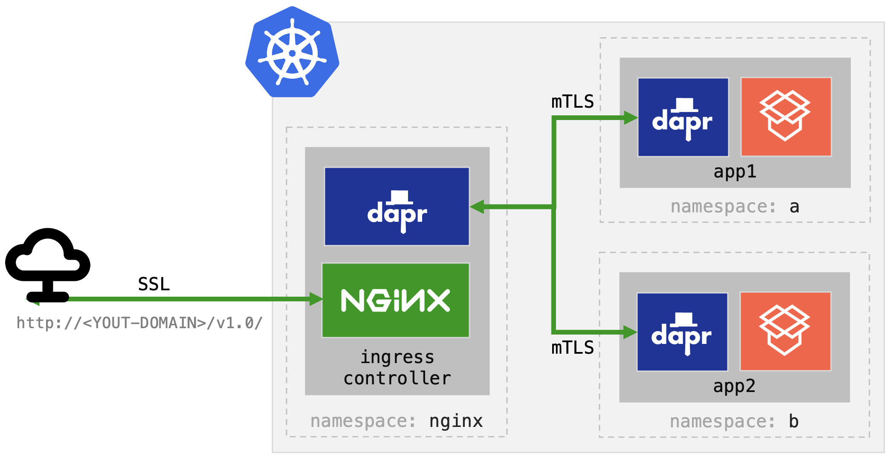

# Dapr API on Cluster Ingress Controller 

This how to will walk through the process of configuring Dapr api on your cluster ingress. The instructions are pretty much the same regardless of the type of ingress you are using. In this how to I'll be using [NGINX](https://nginx.org/en/).



> This how-to assumes you already have Dapr installed in your cluster. If not, consider the opinionated install [here](../setup) or the fully documented instruction in [Dapr docs](https://docs.dapr.io/operations/hosting/kubernetes/).

## Setup

To make this how-to more reproducible, start by defining the namespace where your NGINX ingress is/will be located:

```shell
export INGRESS_NAMESPACE="default"
```

If you are not using `default` namespace, apply also the necessary roles to that namespace:

```shell
kubectl apply -f config/namespace.yml -n $INGRESS_NAMESPACE
```

Next, create a secret to hold the Dapr API token:

```shell
export API_TOKEN=$(openssl rand -base64 32)
kubectl create secret generic dapr-api-token --from-literal=token="${API_TOKEN}" -n $INGRESS_NAMESPACE
```

## Deployment

Next, apply the Dapr config for your ingress (this holds the tracing configuration as well as ensures that the ingress is able to access only the `dapr-api-token` secret we specified above):

```shell
kubectl apply -f config/ingress-config.yaml -n $INGRESS_NAMESPACE
```

Add the Helm repo: 

```shell
helm repo add ingress-nginx https://kubernetes.github.io/ingress-nginx
helm repo update
```

Install NGINX:

> Note, the following command creates 2 replicas to prevent ingress issues during subsequent changes

```shell
helm install nginx ingress-nginx/ingress-nginx \
     --set controller.replicaCount=2 \
     -f config/ingress-annotations.yaml \
     -n $INGRESS_NAMESPACE
```

And wait for the deployment to finish:

```shell
kubectl rollout status deployment/nginx-ingress-nginx-controller -n $INGRESS_NAMESPACE
```

Notice we are adding additional configuration which appends all the necessary pod annotations to dapr'ize the ingress controller. Here is the complete list of annotations that were used in above command:

```yaml
controller:
  podAnnotations:
    dapr.io/enabled: "true" 
    dapr.io/app-id: "nginx-ingress" 
    dapr.io/app-protocol: "http"
    dapr.io/app-port: "80"
    dapr.io/api-token-secret: "dapr-api-token" 
    dapr.io/config: "ingress-config"
    dapr.io/log-as-json: "true"
```

Most of these are self explanatory, including references to both the API token (secret) and ingress config we've created above. You can learn more about all of the annotations supported in Dapr [here](https://docs.dapr.io/operations/hosting/kubernetes/kubernetes-annotations/):


## Configure

Finally, to expose the Dapr API, first change the host name (`api.thingz.io`) in [config/ingress.yaml](config/ingress.yaml) file to the domain name you would like to use:

> Note, you will have to create an A entry in your DNS server in the following step so use a domain you can actually control. `thingz.io` is mine ;) 

```yaml
spec:
  rules:
    - host: api.thingz.io
      http:
        paths:
          - path: /
            backend:
              serviceName: nginx-ingress-dapr
              servicePort: 80
```

When done, apply the ingress to the cluster:

```shell
kubectl apply -f config/ingress.yaml -n $INGRESS_NAMESPACE
```

> See [setup](../setup) for instructions hot to create TLS certificates and configure SSL for your domain.

## DNS

Now that everything is set up, the only thing that's left is to create the DNS entry for your cluster ingress controller. To do that, start by obtaining the public IP address on your ingress:

```shell
kubectl get svc nginx-ingress-nginx-controller \
     -o jsonpath='{.status.loadBalancer.ingress[0].ip}' \
     -n $INGRESS_NAMESPACE
```

Next go to your DNS service dashboard and create an `A` entry for that IP. For example, if your domain you entered in the above Configuration step was `api.thingz.io` and your IP address printed above was `1.2.3.4`, you would create a following entry:

```shell
Name:     Type:      TTL:      Data:
api       A          60s       1.2.3.4
```

The `name` (or `api` in my example above) is basically whatever you want as long as it is the same name you used in the Configuration step above. Also, the `TTL` setting is key as you don't want to wait for long time to have this entry propagate. Some DNS services will have different duration formats, so just aim for the lowest number possible like `1m`.

When done, you can test if the DNS is ready by running `dig` with your domain name (e.g. `api.thingz.io`): 

```shell
dig <your-full-domain-name> 
```

When the A record for your domain name in reflected in the ANSWER SECTION you are ready to test.

## Test 

In case you lost the terminal session when we first defined the `API_TOKEN` variable, capture it again:


```shell
export API_TOKEN=$(kubectl get secret dapr-api-token -o jsonpath="{.data.token}" -n ${INGRESS_NAMESPACE} | base64 --decode)
```

Then curl the Dapr health API to ensure ensure everything works. Just make sure to replace the `<your-full-domain-name>` with your actual domain. 

```shell
curl -i \
     -H "Content-type: application/json" \
     -H "dapr-api-token: ${API_TOKEN}" \
     "http://<your-full-domain-name>/v1.0/healthz"
```

If the response from the Dapr health API is `HTTP/2 200` you are good to go. Check the [hardened demo](../hardened) for example how you can use this API to access services in other namespaces, how to control access to all your Dapr services in the cluster, and how you can get an end-to-end traceability for all invocations including the ingress. 

## Troubleshooting

There are a few places to check if you experience any issues:

* Does the domain name you used resolve to the cluster ingress IP? 
* Has Dapr injected its sidecar into the ingress pod? (Container count on `get pods` should be 2)


## Disclaimer

This is my personal project and it does not represent my employer. While I do my best to ensure that everything works, I take no responsibility for issues caused by this code.

## License

This software is released under the [MIT](../LICENSE)
