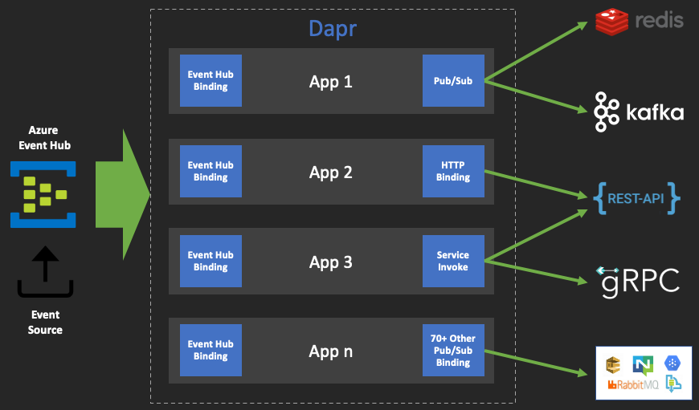

# fan-out demo 

`Fan-out` is a messaging pattern where single message source is "broadcasted" to multiple targets. The common use-case for this may be situation where multiple teams or systems need to receive events from the same source. This is sometimes made even more complicated by the differences in expected formats and protocols by each one of the target systems. 

This demo will illustrate how to use Dapr's plugable component mechanism to `fan-out` events from one Pub/Sub configured with Redis to:

* Kafka topic in CSV format 
* REST endpoint in JSON format 
* gRPC service in XML format 



This allows for incremental modifications with ability to customize each stream according to its unique configuration needs (e.g. throughout, authentication, format, retry strategy, or even error tolerance). For more information about Dapr's pub/sub see these [docs](https://github.com/dapr/docs/tree/master/concepts/publish-subscribe-messaging)

## App 2: Pub/Sub to Pub/Sub Publisher

To run these demos you will need access to Redis and Kafka servers. For Redis, you can use the one installed during local Dapr setup. For Kafka, you can use the included Docker Compose file. First, navigate to the `queue-format-converter` and start Kafka:

```shell
docker-compose -f ./config/kafka.yaml up -d
```

The result should look something like this:

```shell
Creating network "config_default" with the default driver
Creating config_kafka_1     ... done
Creating config_zookeeper_1 ... done
```

Now, start `App 2` which will receive events from Redis, convert them to XML, and publish them onto the Kafka topic:

```shell
dapr run \
    --app-id app2 \
    --app-port 60010 \
    --app-protocol grpc \
    --components-path ./config \
    go run main.go
```

> The source and targets Pub/Sub components are defined in the [./config](./config) directory in their respected files so the use code is free of SDK and libraries which allows for easy re-configuration at run-time. 

Leave the application running, we will come back to it after configuring `App 1`

## App 1: Pub/Sub Event Producer

To demo the above `App 2` we will need events. To produce events, in another terminal session navigate to `queue-event-producer` directory, start the `App 1`: 

```shell
dapr run \
    --app-id app1 \
    --app-port 60013 \
    --app-protocol grpc \
    --components-path ./config \
    go run main.go
```

The app will now publish one event every `3s`. To change the frequency just define the desired duration using `THREAD_PUB_FREQ` variable and restart the app. The results should look something like this:

```shell
== APP == published: {"id":"df50a6c7-b5bb-45ce-b3a8-ad428bbbd5fe","temperature":60.46998219508215,"humidity":94.05150371362079,"time":1598960035}
```

Now in the `App 1`, the log output for each event should look something like this: 

```shell
== APP == Event - PubsubName:fanout-source-pubsub, Topic:events, ID:5ffa4502-8bf1-4bbf-927e-8b62e1949166
== APP == Target (csv): "45ecf820-705b-47c2-a2e4-7dbb3eecb728",66.459360,43.777042,"2020-09-01T04:33:58-07:00"
```

## App 3: Pub/Sub to External REST Endpoint Publisher

To add another publisher which converts the received events into JSON and publishes them to the component defined REST endpoint, first navigate to the `http-format-converter` directory and start `App 3`:

```shell
dapr run \
    --app-id app3 \
    --app-port 60011 \
    --app-protocol grpc \
    --components-path ./config \
    go run main.go
```

> This app is configured with an HTTP binding that defines the target and verb of the invocation. This external configuration allows for easy change of the target binding to something like email using SendGrid or AWS S3 without changing the use-code. To learn more about Dapr bindings, see these [docs](https://github.com/dapr/docs/tree/master/concepts/bindings#supported-bindings-and-specs)

```yaml
apiVersion: dapr.io/v1alpha1
kind: Component
metadata:
  name: fanout-http-target-post-binding
spec:
  type: bindings.http
  metadata:
  - name: url
    value: https://postman-echo.com/post
  - name: method
    value: POST
```

If the `App 1` is still running, you should see entries in the log similar to this:

```shell
== APP == Event - PubsubName:fanout-source-pubsub, Topic:events, ID:d5bbcc9e-f0d3-46df-8d8e-f7dadb3f304c
== APP == Target (json): {"temperature":20.326656,"humidity":36.093533,"time":1598961599,"id":"b2fa85cf-1be6-4489-9aec-613cf969675e"}
```

## App 4: Pub/Sub to another Dapr Service Publisher 

To add the final publisher, which will convert events into XML format and publish them to another Dapr service over gRPC, first navigate to the `grpc-echo-service` directory and start target service. For demo purposes, we will use the included echo service which simply returns whatever message it receives.

```shell
dapr run \
    --app-id grpc-echo-service \
    --app-port 60015 \
    --app-protocol grpc \
    go run main.go
```

Then, in yet another terminal session, navigate to the `service-format-converter` directory and start the `App 4` that will invoke the `grpc-echo-service`:

```shell
dapr run \
    --app-id app4 \
    --app-port 60012 \
    --app-protocol grpc \
    --components-path ./config \
    go run main.go
```

If everything went well, you should see something similar in the `App 4` logs: 

```shell
== APP == Target: &{Data:[60 84 111 112 105 99 69 118...] ContentType:application/xml}
== APP == Response: <TopicEvent><ID>df450605-4927-407e-a2b2-61233939ee58</ID><SpecVersion>1.0</SpecVersion><Type>com.dapr.event.sent</Type><Source>app1</Source><DataContentType>application/json</DataContentType><Data>{&#34;time&#34;:1598962950,&#34;id&#34;:&#34;745e3ebe-990b-4292-9347-f84ff81f41e6&#34;,&#34;temperature&#34;:31.812637,&#34;humidity&#34;:46.894296}</Data><Subject></Subject><Topic>events</Topic><PubsubName>fanout-source-pubsub</PubsubName></TopicEvent>
```

> If you left all the apps running, you can go to each terminal session and see the different formats which are generated and published by each application.


## Disclaimer

This is my personal project and it does not represent my employer. I take no responsibility for issues caused by this code. I do my best to ensure that everything works, but if something goes wrong, my apologies is all you will get.

## License

This software is released under the [MIT](../LICENSE)
