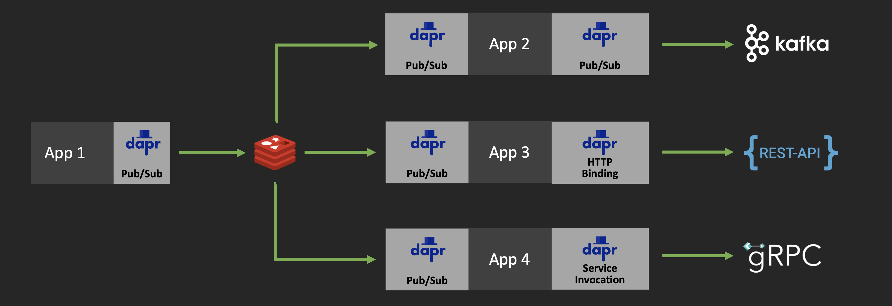

# fan-out demo 

`Fan-out` is a messaging pattern where single message source is "broadcasted" to multiple targets. The common use-case for this may be situation where multiple teams or systems need to receive events from the same source. This is sometimes made even more complicated by the differences in expected formats and protocols by each one of the target systems. 

This demo will illustrate how to use Dapr's plugable component mechanism to `fan-out` events from one Pub/Sub configured with Redis to:

* Kafka topic in CSV format 
* REST endpoint in JSON format 
* gRPC service in XML format 



For more information about Dapr's pub/sub see these [docs](https://github.com/dapr/docs/tree/master/concepts/publish-subscribe-messaging)

## App 2 (Pub/Sub to Pub/Sub Publisher) 

Start by navigating to the `queue-format-converter` and starting `App 2` in the above diagram. To run these demos you will need access to Redis and Kafka servers. For Redis, you can use the one installed with Dapr as a container during setup. For Kafka, you can use the included Docker Compose file:

```shell
docker-compose -f ./config/kafka.yaml up -d
```

The result should look something like this:

```shell
Creating network "config_default" with the default driver
Creating config_kafka_1     ... done
Creating config_zookeeper_1 ... done
```

Now, start `App 2` which will receive events from Redis, convert them to XML, and publish them onto the Kafka topic:

```shell
dapr run \
    --app-id app2 \
    --app-port 60010 \
    --app-protocol grpc \
    --components-path ./config \
    go run main.go
```

Leave the application running, we will come back to it after configuring `App 1`

## App 1 (Pub/Sub Producer)

To demo the above `App 2` we will need events. To produce events, in another terminal session in `queue-event-producer` directory, start the `App 1`: 

```shell
dapr run \
    --app-id app1 \
    --app-port 60013 \
    --app-protocol grpc \
    --components-path ./config \
    go run main.go
```

The app will now start producing an event every `3s`. To change the frequency just define the `THREAD_PUB_FREQ` variable and restart the app. The results should look something like this:

```shell
== APP == published: {"id":"df50a6c7-b5bb-45ce-b3a8-ad428bbbd5fe","temperature":60.46998219508215,"humidity":94.05150371362079,"time":1598960035}
```

Now in the `App 1`, the log output for each event should look something like this: 

```shell
== APP == Event - PubsubName:fanout-source-pubsub, Topic:events, ID:5ffa4502-8bf1-4bbf-927e-8b62e1949166
== APP == Target (csv): "45ecf820-705b-47c2-a2e4-7dbb3eecb728",66.459360,43.777042,"2020-09-01T04:33:58-07:00"
```

## App 3 (Pub/Sub to External REST Endpoint)

To add another publisher which will convert the events into JSON format and publish them to the REST endpoint, first navigate to the `http-format-converter` directory and start `App 3`:

```shell
dapr run \
    --app-id app3 \
    --app-port 60011 \
    --app-protocol grpc \
    --components-path ./config \
    go run main.go
```


##### CSV

```shell
export TARGET_TOPIC_FORMAT="csv" 
export TARGET_PUBSUB_NAME="fanout-queue-kafka-target"
export ADDRESS=":60020"
```

Now run the service using Dapr:

```shell
dapr run \
    --app-id kafka-csv-publisher \
    --app-port 60020 \
    --app-protocol grpc \
    --components-path ./config \
    go run main.go
```

##### Output

The terminal output should include the received event and the event that was published to the target

```shell
== APP == Source: {"id":"8453c94e-1ff0-47d1-b0f9-7936c5be3d98","temperature":51.52611072392151,"humidity":81.36585969939978,"time":1598361172}
== APP == Target: <SourceEvent><ID>8453c94e-1ff0-47d1-b0f9-7936c5be3d98</ID><Temperature>51.52611072392151</Temperature><Humidity>81.36585969939978</Humidity><Time>1598361172</Time></SourceEvent>
```

#### Event Hubs to REST endpoint in JSON format

This step will subscribe to the Event Hub source using Dapr binding, convert the incoming events into JSON, and publish them to the pre-configured REST endpoint using Dapr HTTP binding. The specific endpoint as well as method (`POST` vs `GET` for example) is defined by the Dapr component found in the `./config` directory. Dapr has a wide array of [output bindings](https://github.com/dapr/docs/tree/master/concepts/bindings#supported-bindings-and-specs) (e.g. Twilio, SendGrid, MQTT...), for this example we will use HTTP. 

> To change the target, simply update the [http-format-converter/config/target-binding.yaml](./http-format-converter/config/target-binding.yaml) file with the desired output binding.

To start, navigate to the directory (`cd ./http-format-converter`) and export the desired format:

```shell
export TARGET_TOPIC_FORMAT="json" 
```

Now run the service using Dapr:

```shell
dapr run \
    --app-id http-json-publisher \
    --app-port 60011 \
    --app-protocol grpc \
    --components-path ./config \
    go run main.go
```

The terminal output should include the received event and the event that was published to the target

```shell
== APP == Target: {"id":"ef658e1f-a16d-4cc7-99a9-6e17d5542fb8","temperature":66.45935972131686,"humidity":43.77704157682614,"time":1598373740}
```

#### Event Hubs to gRPC service in binary format 

This step will subscribe to the Event Hub source using Dapr binding, convert the incoming events into target service expecting format, and publish them to the Dapr service identified by name. The discovery of the target service as well as the mTLS encryption and protocol translation (if necessary in case HTTP to gPRC or gPRC to HTTP invocation) are handled automatically by Dapr. You can learn more about the service to service invocation in Dapr [here](https://github.com/dapr/docs/blob/master/concepts/service-invocation/README.md#service-invocation)

> For purposes of this demo, we are going to use the [grpc-echo-service](../grpc-echo-service). You will need to start that service before this one. You can find instructions [here](../grpc-echo-service)

To start, navigate to the directory (`cd ./service-format-converter`) and export the desired format:

```shell
export TARGET_SERVICE="grpc-echo-service"
export TARGET_METHOD="echo"
```

Now run the service using Dapr:

```shell
dapr run \
    --app-id grpc-service-publisher \
    --app-port 60012 \
    --app-protocol grpc \
    --components-path ./config \
    go run main.go
```

The terminal output should include the received event and the event that was published to the target

```shell
== APP == Source: {"id":"bc2e96cd-a3f0-4a49-bcdf-cda5d077449f","temperature":67.91167674526243,"humidity":21.8631197287505,"time":1598376230}
== APP == Target: &{Data:[123 34 105 100 34 58 34 98 99 50 101 57 54 99 100 45 97 51 102 48] ContentType:application/json}
```

## Events 

For this demo we will need an event source. Start by, create your Event Hubs (if you don't already have one) using [these instructions](https://docs.microsoft.com/en-us/azure/event-hubs/event-hubs-create). Then capture the connection string using [these instructions](https://docs.microsoft.com/en-us/azure/event-hubs/event-hubs-get-connection-string). 

To mock up events we will use the included `./eventmaker` utility which will generate random `temperature` and `humidity` events and publish them to the Event Hub. Navigate to the `./eventmaker` directory and run:

```shell
go run *.go --conn "your-eventhubs-connection-string"
```

> Make sure to replace the `your-eventhubs-connection-string` string with your Event Hubs connection string

The output should look something like this:

```shell
sending: {"id":"775ccb8f-8039-4c97-9849-15fdf6a26a1e","temperature":60.46998219508215,"humidity":94.05150371362079,"time":1598373738}
sending: {"id":"ef658e1f-a16d-4cc7-99a9-6e17d5542fb8","temperature":66.45935972131686,"humidity":43.77704157682614,"time":1598373740}
```

## Disclaimer

This is my personal project and it does not represent my employer. I take no responsibility for issues caused by this code. I do my best to ensure that everything works, but if something goes wrong, my apologies is all you will get.

## License

This software is released under the [MIT](../LICENSE)
