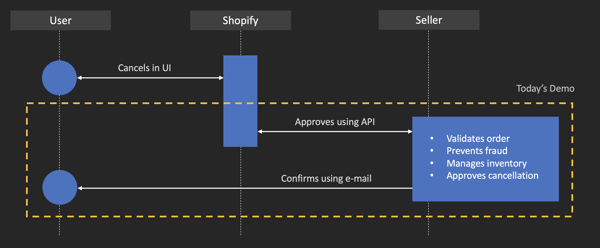
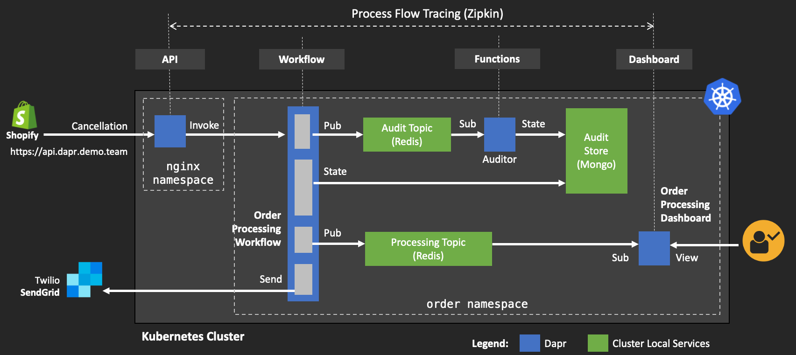
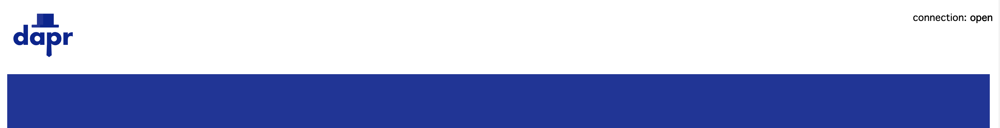

# Dapr integrations demo

> WIP: This demo is being currently updated to Dapr v1.0.0.rc-1

## Use-case

Order cancellation demo, loosely based on [Shopify API](https://shopify.dev/docs/admin-api/rest/reference/orders/order?api[version]=2020-04) order cancellation use-case to showcase multiple Dapr service integrations in a single solution: 



## Component Overview 

* **Dapr API** endpoint published with JWT token auth in **Daprized Ngnx** ingress
* **Dapr Workflows** to orchestrate cancellation process using **Logic Apps** runtime
* **Dapr Functions** extensions to create and persist audit state into **Mongo DB**
* **Dapr Eventing** using **Redis Queue** for order message queue
* **Daprized Web App** as order processing dashboard
* **Dapr Binding** to send confirmation emails using **SendGrid**
* **Dapr Distributed Tracing** to capture and forward traces to **Zipkin**




## Demo 

Dapr integration demo consists of:

1. Starting the order processing dashboard 
2. Submitting cancellation request 
3. Viewing processed request in the dashboard 
4. Querying the state store for cancellation data
5. Showing order cancellation confirmation email 
6. Review of the distributed traces for entire process 

> Note, instructions on how to setup a Kubernetes cluster for this demo are located [here](../setup/README.md)

### 1. Dashboard 

> Note, these instructions assume `demo.dapr.team` domain setup in the [cluster setup](../setup/README.md) step. You will need to substitute this for your own domain. 

Navigate to https://order.demo.dapr.team to start the order processing dashboard. There won't be any data yet, so this is just to open the WebSocket connection. 



### 2. Submit Cancellation 

Submit the order [cancellation.json](demo/data/cancellation.json) file using `curl`

```shell
API_TOKEN=$(kubectl get secret dapr-api-token -n nginx -o jsonpath="{.data.token}" | base64 --decode)
curl -i \
     -d @demo/data/cancellation.json \
     -H "Content-type: application/json" \
     -H "dapr-api-token: ${API_TOKEN}" \
     "https://api.demo.dapr.team/v1.0/invoke/workflows.order/method/order-cancel"
```

### 3. Dashboard (updated)

View the dashboard again at https://order.demo.dapr.team to see the orders

### 4. Email 

Check configured email box for cancellation confirmation after the processed completed 

> Make sure to check junk mail!

### 5. Observability 

Forward local ports:

```shell
kubectl port-forward svc/kibana-kibana 5601 -n dapr-monitoring &
kubectl port-forward svc/grafana 8888:80 -n dapr-monitoring &
kubectl port-forward svc/zipkin 9411 -n dapr-monitoring &
```

#### Traces

Navigate to Zipkin: http://localhost:9411

#### Logs 

Navigate to Kibana: http://localhost:5601

#### Metrics 

Navigate to Grafana: http://localhost:8888

## Setup  

For script through this demo see [setup](./demo).


