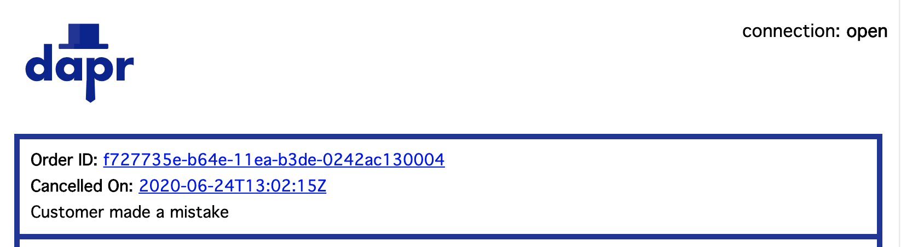
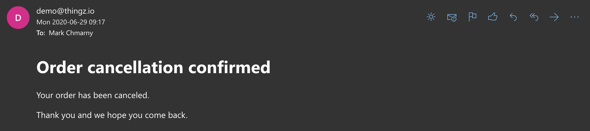
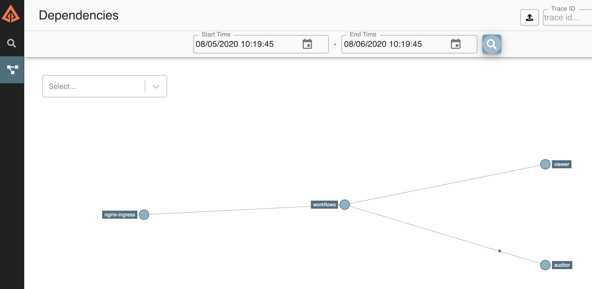

# Dapr integrations demo

Dapr integration demo consists of:

1. Starting the order processing dashboard 
2. Submitting cancellation request 
3. Viewing processed request in the dashboard 
4. Querying the state store for cancellation data
5. Showing order cancellation confirmation email 
6. Review of the distributed traces for entire process 

> NOte, instructions on how to setup a Kubernetes cluster for this demo are located [here](../setup/README.md)

### 1. Dashboard 

> Note, these instructions assume `cloudylabs.dev` domain setup in the [cluster setup](../setup/README.md) step. You will need to substitute this for your own domain. 

Navigate to https://view.cloudylabs.dev/ to start the order processing dashboard. There won't be any data yet, so this is just to open the WebSocket connection. 


### 2. Submit Cancellation 

Submit the order [cancellation.json](data/cancellation.json) file using `curl`

```shell
API_TOKEN=$(kubectl get secret dapr-api-token -o jsonpath="{.data.token}" | base64 --decode)
curl -v \
     -d @data/cancellation.json \
     -H "Content-type: application/json" \
     -H "dapr-api-token: ${API_TOKEN}" \
     "https://api.cloudylabs.dev/v1.0/invoke/workflows/method/order-cancel"
```

### 3. Dashboard (updated)

Back in the dashboard UI, there should be now processed cancellation 



### 4. Email 

Show confirmation email delivered after the processed completed 

> Note, email may be in junk folder 



## 5. Observability 

### Distributed Traces 

Forward local port to Zipkin

```shell
kubectl port-forward svc/zipkin 9411:9411 &
```

Navigate to http://localhost:9411




### Logging 

Forward local port to Kibana

```shell
kubectl port-forward svc/kibana-kibana 5601 -n dapr-monitoring &
```

Navigate to http://localhost:5601


### Metrics 

Forward local port to Grafana

```shell
kubectl port-forward svc/grafana 8080:80 -n dapr-monitoring &
```

Get the Grafana admin password 

```shell
export GPASS=$(kubectl get secret -n dapr-monitoring grafana -o jsonpath="{.data.admin-password}" | base64 --decode)
echo "Grafana admin password is: ${GPASS}"
```

Navigate to http://localhost:8080 and use `admin` as username and the above printed password


