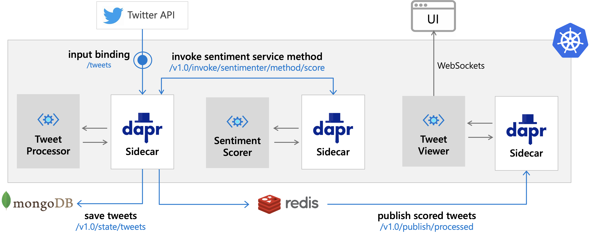

# Dapr pipeline demo 

Dapr supports a wide array of state and pubsub building blocks across multiple OSS, Cloud, and on-prem services. This demo shows how to use a few of these components to build tweet sentiment processing pipeline.




## Run in standalone mode

### Setup 

To run these demos locally, you will have first create a secret file (`pipeline/secrets.json`). These will be used by Dapr components at runtime. To get the Twitter API secretes you will need to register your app [here](https://developer.twitter.com/en/apps/create).

```json
{
    "Twitter": {
        "ConsumerKey": "",
        "ConsumerSecret": "",
        "AccessToken": "",
        "AccessSecret": ""
    },
    "Azure": {
        "CognitiveAPIKey": ""
    }
}
```


### Start tweet viewer app 

Navigate to the [tweet-viewer](./tweet-viewer) directory and run:

```shell
cd tweet-viewer
dapr run \
    --app-id tweet-viewer \
    --app-port 8084 \
    --app-protocol http \
    --components-path ./config \
    go run main.go
```

Once the app starts, you should be able to navigate to http://localhost:8084/. There won't be anything there yet, but if you see `connection: open` in the top right corner that means the WebSocket connection to the back-end is established. 


### Start sentiment scoring service 

Navigate to the [sentiment-scorer](./sentiment-scorer) directory and run:

```shell
cd sentiment-scorer
dapr run \
    --app-id sentiment-scorer \
    --app-port 60005 \
    --app-protocol grpc \
    --components-path ./config \
    go run main.go
```

The last line from the above command should be

```shell
✅  You're up and running! Both Dapr and your app logs will appear here.
```

### Start tweet processing service 

Navigate to the [tweet-processor](./tweet-processor) directory and run:

```shell
cd tweet-processor
dapr run \
    --app-id tweet-processor \
    --app-port 60002 \
    --app-protocol grpc \
    --components-path ./config \
    go run main.go
```

The last line from the above command should be

```shell
✅  You're up and running! Both Dapr and your app logs will appear here.
```


### Start tweet provider

Navigate to the [tweet-provider](./tweet-provider) directory and run:

```shell
cd tweet-provider
dapr run \
		--app-id tweet-provider \
    --app-port 8080 \
    --app-protocol http \
    --components-path ./config \
    go run main.go
```

The last line from the above command should be

```shell
✅  You're up and running! Both Dapr and your app logs will appear here.
```

### View sentiment scored tweets in the UI 

Navigate once more to http://localhost:8084/ and provided there were tweets matching your query you should now see tweets displayed in the UI. 


## Run on Kubernetes 

> Note, these instructions assume cluster created using the [demo setup](../setup).

### namespace 

Start by setting up the namespace for the `pipeline`:

```shell
kubectl apply -f k8s/space.yaml
```

### tweet-processor

Next, deploy `tweet-processor` and wait for it to be ready

```shell
kubectl apply -f k8s/process-pubsub.yaml
kubectl apply -f k8s/tweeter-pubsub.yaml
kubectl apply -f k8s/processor.yaml
kubectl rollout status deployment/tweet-processor -n pipeline
```

Check the Dapr logs to make sure the components were registered correctly 

```shell
kubectl logs -l app=tweet-processor -c daprd -n pipeline --tail 200
```

### sentiment-scorer

Create a secret for Azure Cognitive Services

```shell
kubectl create secret generic sentiment-secret \
    -n pipeline \
    --from-literal=token="your-azure-cognitive-service-token"
```

Deploy `sentiment-scorer` and wait for it to be ready 

```shell
kubectl apply -f k8s/scorer.yaml
kubectl rollout status deployment/sentiment-scorer -n pipeline
```

Check the logs to make sure Dapr was started correctly 

```shell
kubectl logs -l app=sentiment-scorer -c daprd -n pipeline --tail 200
```

To test the service, you can first export the API token

```shell
export API_TOKEN=$(kubectl get secret dapr-api-token -o jsonpath="{.data.token}" -n nginx | base64 --decode)
```

And then invoke the service manually

```shell
curl -i -d '{ "text": "dapr is the best" }' \
     -H "Content-type: application/json" \
     -H "dapr-api-token: ${API_TOKEN}" \
     "https://api.demo.dapr.team/v1.0/invoke/sentiment-scorer.pipeline/method/sentiment"
```

Response should look something like this 

```json 
{ "sentiment":"positive", "confidence":1 }
```


### tweet-viewer

Create the TLS certs for this domain 

> `demo.dapr.team` is the domain I'm using for this demo

```shell
kubectl create secret tls tls-secret \
    -n pipeline \
    --key ../setup/certs/demo.dapr.team/cert-pk.pem \
    --cert ../setup/certs/demo.dapr.team/cert-ca.pem
```

Deploy `tweet-viewer` along with its component

```shell
kubectl apply -f k8s/viewer.yaml
kubectl apply -f k8s/ingress.yaml
kubectl rollout status deployment/tweet-viewer -n pipeline
```

Check that the ingress was updated 

```shell
kubectl get ingress -n pipeline
```

Should include `viewer.`

```shell
NAME            HOSTS                   ADDRESS   PORTS     AGE
ingress-rules   tweets.demo.dapr.team   x.x.x.x   80, 443   1m
```

Check in browser: https://tweets.demo.dapr.team

### tweet-provider

Create secret for `tweet-provider` to connect to Twitter API 

> Check [twitter developer portal](https://developer.twitter.com/en/portal/dashboard) if you need this info

```shell
kubectl create secret generic twitter-secret -n pipeline \
  --from-literal=consumerKey="" \
  --from-literal=consumerSecret="" \
  --from-literal=accessToken="" \
  --from-literal=accessSecret=""
```

Deploy the `tweet-provider` service and its components

```shell
kubectl apply -f k8s/state.yaml
kubectl apply -f k8s/twitter.yaml
kubectl apply -f k8s/provider.yaml
kubectl rollout status deployment/tweet-provider -n pipeline
```

Check Dapr to make sure components were registered correctly 

```shell
kubectl logs -l app=tweet-provider -c daprd -n pipeline --tail 200
```

## View

Navigate back to: https://tweets.demo.dapr.team

If everything went well, you should see some tweets appear. 

> Note, this demo shows only tweets meeting your query posted since the viewer was started. If you chosen an unpopular search term you may have to be patient

## Restart deployments 

If you change the components you need to apply rolling upgrades to the deployments 

```shell
kubectl rollout restart deployment/sentiment-scorer -n pipeline
kubectl rollout restart deployment/tweet-processor -n pipeline
kubectl rollout restart deployment/tweet-provider -n pipeline
kubectl rollout restart deployment/tweet-viewer -n pipeline
kubectl rollout status deployment/sentiment-scorer -n pipeline
kubectl rollout status deployment/tweet-processor -n pipeline
kubectl rollout status deployment/tweet-provider -n pipeline
kubectl rollout status deployment/tweet-viewer -n pipeline
```

## Debug

Start by reviewing that all the pods are running:

```shell
kubectl get pods -n pipeline
```

The response should look something like this. Notice the `2/2` container readiness in each pod and the status `Running`

```shell
NAME                                READY   STATUS    RESTARTS   AGE
sentiment-scorer-64b9b8fb48-czn5h   2/2     Running   0          10m
tweet-processor-75cff98984-skmx8    2/2     Running   0          10m
tweet-provider-b47b566b5-7vs9r      2/2     Running   0          10m
tweet-viewer-5cf465d4d8-crfk2       2/2     Running   0          10m
```

Next check the `daprd` and `service` logs on each deployment to make sure all the components loaded correctly. The `tweet-provider` for example would be: 

```shell
kubectl logs -l app=tweet-provider -c daprd -n pipeline --tail 300
kubectl logs -l app=tweet-provider -c service -n pipeline --tail 300
```

## Disclaimer

This is my personal project and it does not represent my employer. While I do my best to ensure that everything works, I take no responsibility for issues caused by this code.

## License

This software is released under the [MIT](../LICENSE)
